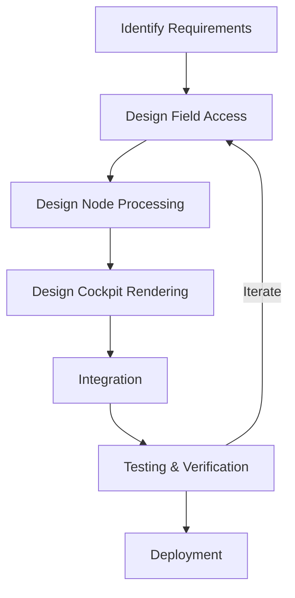

# Figures and Diagrams

This directory contains visual materials for the Consciousness by Design framework.

## Planned Contents

### Core Diagrams

1. **fnc_engineering.png** (To be added)
   - Visual representation of the FNC architecture for engineered consciousness
   - Shows Field-Node-Cockpit relationships in designed systems

2. **design_architecture.png** (To be added)
   - Complete system architecture for conscious AI
   - Component interactions and data flow

3. **measurement_framework.png** (To be added)
   - Framework for measuring consciousness in designed systems
   - Verification criteria and metrics

### Additional Visuals

4. **consciousness_levels.png** (To be added)
   - Gradations of consciousness in AI systems
   - Mapping different designs to consciousness depth

5. **integration_patterns.png** (To be added)
   - Visual guide to integration patterns
   - Field-Node-Cockpit coupling mechanisms

6. **ethical_framework.png** (To be added)
   - Decision tree for ethical considerations
   - Guidelines for responsible development

## Creating Figures

Figures should be created following these guidelines:

### Style Guidelines
- Use consistent color scheme:
  - Field: Blue (#1976d2)
  - Node: Orange (#f57c00)
  - Cockpit: Purple (#7b1fa2)
- High resolution (300 DPI minimum for print)
- Clear labels and legends
- Accessible to colorblind readers

### Format Guidelines
- Primary format: PNG with transparency
- Vector versions (SVG) preferred when possible
- PDF versions for print materials

### Diagram Tools
Recommended tools for creating diagrams:
- Mermaid (for flowcharts and architecture diagrams)
- draw.io / diagrams.net (for complex diagrams)
- TikZ/LaTeX (for publication-quality figures)
- Inkscape (for vector graphics)

## Mermaid Examples

You can generate some diagrams using Mermaid markdown syntax:

### FNC Architecture


### Design Process


## Usage

When referencing figures in documentation or papers:
```markdown

*Figure 1: The Field-Node-Cockpit architecture for engineered consciousness.*
```

## License

All figures are licensed under CC BY 4.0. See [../LICENSE](../LICENSE) for details.

When using figures:
- Provide attribution: "Wikström, B. (2025). Consciousness by Design."
- Indicate if modifications were made
- Link back to this repository

## Contributing Figures

To contribute figures:
1. Follow style and format guidelines above
2. Provide source files (editable formats)
3. Include figure captions and descriptions
4. Submit via pull request or contact bjorn@base76.se

---

**Note**: This directory currently contains placeholder information. Actual figures will be added as the research develops.
